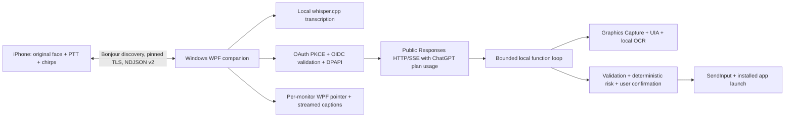

# Architecture

## Projects and responsibilities

* `GooglyWindows.Core` (.NET 10): wire packets/framing, OAuth cryptographic
  primitives and refresh gate, SSE parsing, subscription errors, conversation
  input building, schemas/validation/risk, shortcut mapping, physical/DPI mapping,
  target IDs and local whisper.cpp process/resampling adapter. No WPF dependencies.
* `GooglyWindows` (.NET 10 WPF): OAuth browser/callback/JWKS validation, DPAPI,
  TLS server, bounded pairing registry, IPv4 mDNS, account-specific discovery,
  capability probes, capture/UIA/OCR, OS input/app catalog, overlay, tray/settings,
  local history, startup and emergency stop. CompanionRuntime owns lifecycle.
* `GooglyWindows.Tests`: portable executable test harness. It links the actual
  host OAuth/TLS/pairing/logging sources with an explicitly test-only in-memory
  storage double; it does not pretend to test DPAPI on Linux. AI HTTP/SSE fixtures
  are test-only. Optional environment variables enable real local Whisper audio.
* `iOS`: FaceView, BlobShape, moods and gesture art remain original. The internal
  LiveVoice alias now points to PushToTalkController. MacLink's internal name is
  retained but its transport is now TLS/pairing to Windows. There is no iPhone
  OpenAI client or token flow. SessionStore retains the original transcript UI.
* `Mac`: unchanged upstream legacy app, excluded from the default port. It still
  has its original API-key behavior and is not needed for the Windows product.

## Authentication boundaries

Only Windows holds OAuth credentials. A stable host UUID and the issued client
registration persist across restarts. Sign-in attempts use independent state,
nonce and PKCE values; callback input is length bounded and state checked before
code exchange. ID tokens are signature/issuer/audience/expiry/nonce validated
against HTTPS-discovered JWKS. The token response's scopes determine plan access.

DPAPI CurrentUser encrypts credential, pairing, host ID and certificate records.
Writes replace the complete file atomically. One app process per Windows user and
one shared async gate serialize sign-in, sign-out and refresh. Refresh updates
access token, expiry, scopes and rotating refresh token as one protected record.
An uncertain refresh transport is not blindly replayed.

The network server is TLS 1.2/1.3 with a persisted certificate. Windows Schannel
requires a key in the current user OS-protected key store; the certificate import
uses UserKeySet without PersistKeySet and disposes it at shutdown. Only the
DPAPI-encrypted PFX is durable. Linux tests use EphemeralKeySet. Initial pairing
requires human certificate fingerprint comparison plus a temporary code. A paired
phone authenticates a host/device/nonce-bound HMAC. No voice/tool request executes
before authentication. Framing caps packets at 8 MiB; active TCP clients are
bounded. The phone pings every 15 seconds and retries with bounded backoff.
Device disconnection cancels that peer's ongoing requests.

## Protocol v2

Original optional fields remain. Added fields are protocolVersion, deviceID,
hostID, nonce, proof, code, secret and errorCode. The hello/challenge includes v2;
legacy v1 connections cannot bypass pairing. NDJSON commands include pair,
pair_challenge, authenticate, paired, pair_required, pair_error, ping/pong,
voice_request/text_request, transcript, assistant_delta/done/error,
tool_started/done, face, awake/asleep and cancel_request. Significant requests
have callID; duplicate IDs are rejected per connection. FaceState uses gazeX,
gazeY, mood and talk, unchanged from the original.

## AI and conversation

The official model catalog returns models with visibility, slug and display_name.
No agent model is hardcoded. A selected model must complete small text/vision/
namespace-function probes. Reasoning is marked observed only if reasoning items
actually appear. Web search gets a separate probe. Unsupported capabilities never
cause API-key fallback. Current documented subscription audio is unavailable;
transcription always uses the configured local engine.

Responses requests use instructions, array input, store:false and stream:true.
Every response must reach response.completed. Partial deltas are provisional;
failed/incomplete/disconnected streams produce an error and no successful history
commit. 429 plan limits pause further requests until the user chooses Resume.
Transient admission failures have bounded backoff; partially streamed inference
and computer actions are not automatically replayed.

A turn retains full returned output items and function_call_output pairs, adding
image input only when look_at_screen produced a fresh screenshot. Up to 12 model
rounds run sequential tools with cancellation/timeouts. Between turns, context
keeps the latest eight user/assistant text pairs; screenshots, audio and detailed
observation/tool items do not survive into durable history. Each phone has its
own in-memory conversation, and the host serializes computer operations.

## Screen and controls

Capture is on demand, with a temporary Windows.Graphics.Capture session per
monitor and a composed physical virtual desktop. UIA control IDs are C#, OCR
line/word IDs L#/W#. Coordinates use a single CoordinateMapper and per-monitor
DPI; screenshots and targets share the same physical bounds, including negative
origins. A selected control is revalidated before clicking; actions invalidate
snapshot IDs. UIA traversal has a budget and a single bounded worker if a native
provider stalls. OCR tries English/Hebrew engines and optionally local Tesseract.
Password controls are excluded from text and their known rectangles masked.

All own top-level overlay/panel windows request WDA_EXCLUDEFROMCAPTURE;
observation fails closed if Windows rejects exclusion for any of them. Per-monitor
WPF windows are transparent, click-through, topmost, no-activate and DPI aware.
Native capture exclusion, actual coordinates and elevated-app behavior still need
physical Windows validation. DRM/secure desktops may not be capturable.

## Safety, privacy and lifecycle

Schemas and runtime validation limit every tool. A deterministic classifier flags
sensitive labels/intents, destructive/commit keys, newline submission and blind
coordinate actions. Ambiguous action intent and shell typing require confirmation.
Password typing is refused. Confirmation is an app UI decision, not an AI promise;
denial/timeout yields a tool result and performs no action. Ctrl+Alt+S cancels
work and disables control. These heuristics cannot recognize every possible
sensitive workflow; user supervision remains necessary.

History is optional under `%LOCALAPPDATA%\GooglyEyes\Sessions`; it records
transcripts, completed answers, tool names and concise outcomes. No screenshots
or audio are saved there. Local processing creates temporary files and removes
them afterward; stale app-specific temporary directories are cleaned on launch.
Logs accept categorical events/numeric development timings, redact token patterns,
and omit request/response bodies. Tokens are never passed to UI bridge/phone,
logs or command-line processes. Startup uses an opt-in HKCU Run value and no admin.

The live subscription stream can leave `response.completed.response.output` empty.
The client retains `response.output_item.done` items by output index, including
function calls and encrypted reasoning, and releases them to the agent only
after `response.completed`. This was verified with real plan inference.
